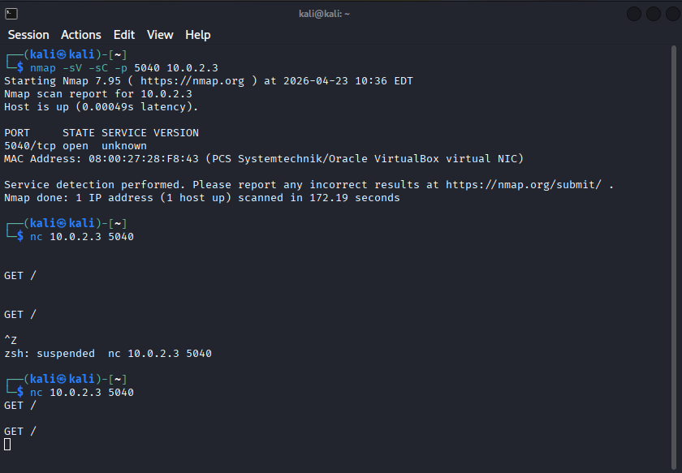

# Service-Investigation-and-Interaction-Lab

# Service Investigation and Interaction Lab

## Overview

This project demonstrates a cybersecurity lab focused on investigating an unknown service running on port 5040.

The objective was to analyze the service behavior using multiple techniques and determine how it responds to different types of interaction.

---

## Lab Setup

* Attacker Machine: Kali Linux
* Target Machine: Windows 10 Virtual Machine
* Environment: VirtualBox (NAT Network)

---

## Tools Used

* Nmap (service detection and scanning)
* Netcat (manual interaction)

---

## Key Activities

### 1. Targeted Service Scan

* Identified port 5040 as open
* Attempted service identification using version detection and scripts

### 2. Manual Interaction

* Connected to the service using Netcat
* Sent HTTP-style request (`GET /`)
* Observed no response

### 3. Banner Grabbing

* Attempted to extract service information
* No banner data returned

### 4. Aggressive Scan

* Performed advanced scan using `-A -Pn`
* Confirmed service remained unknown

---

## Key Findings

* Port 5040 is open and actively accepting connections
* The service does not respond to standard HTTP requests
* No banner or identifying information is exposed
* The service could not be identified using common tools and techniques

---

## Example Output

*Figure 1: Deep scan showing port 5040 open and unidentified*

*Figure 2: Manual interaction attempt with no response*

---

## Conclusion

This lab demonstrates that not all services can be easily identified using standard tools. The investigation showed that the service on port 5040 is active but does not expose useful information, suggesting it may use a custom or restricted protocol.

---

## Author

VEIDEE
